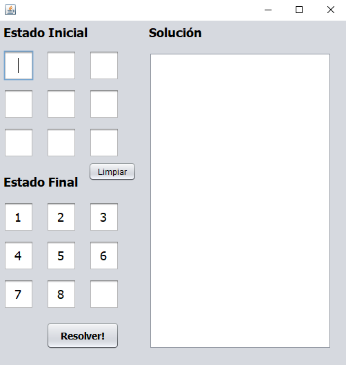
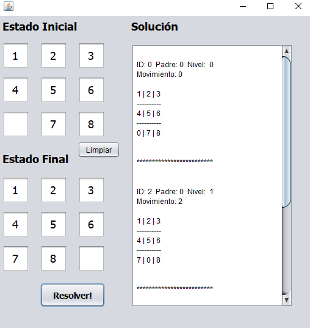
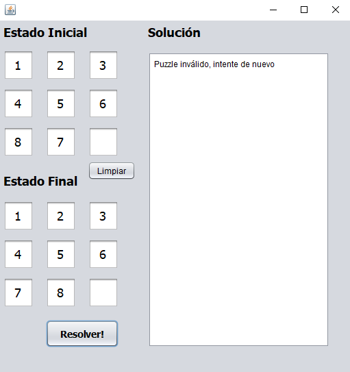

# Tarea A*

Para esta tarea primero implementé A* completo en Java, el código correspondiente se enccuentra en la carpeta 
[JavaImplementation](https://github.com/FranciscoBuru/Inteligencia_Artificial/tree/main/Tareas/A*/JavaImplementation). 

## Para el proyecto general
El código de CLISP (CLISP 2.49) se encuentra en la carpeta [lisp](https://github.com/FranciscoBuru/Inteligencia_Artificial/tree/main/Tareas/A*/lisp) y finalmente el código de 
la interfáz está en la carpeta [GUI](https://github.com/FranciscoBuru/Inteligencia_Artificial/tree/main/Tareas/A*/GUI)

## Instrucciones de ejecución.

#### Antes de empezar
Crear un directorio local `path/to/project/`, sirve como directorio auxiliar para la ejecución.
#### Interfáz gráfica
  Descargar los archivos en la carpeta [GUI](https://github.com/FranciscoBuru/Inteligencia_Artificial/tree/main/Tareas/A*/GUI) y correrlos usando JDK 1.8. La interfáz debe 
  verse como sigue. 
#### Solver en CLISP
 Descargar el archivo [puzzle.lisp](https://github.com/FranciscoBuru/Inteligencia_Artificial/blob/main/Tareas/A*/lisp/puzzle.lisp) y guardarlo en `path/to/project/` sin cambiar 
 el nombre de `puzzle.lisp`
#### Cambios necesarios en interfáz
  1. Cambiar directorio en línea 35 de [puzzle_solver](https://github.com/FranciscoBuru/Inteligencia_Artificial/blob/main/Tareas/A*/GUI/puzzle_solver.java)
    por `path/to/project/somefile.dat` y crear un archivo vacío llamado `somefile.dat`.
  2.  Cambiar directorio en línea 440 de [puzzle_solver](https://github.com/FranciscoBuru/Inteligencia_Artificial/blob/main/Tareas/A*/GUI/puzzle_solver.java)
     por `path/to/project/entrada.txt` y crear un archivo vacío llamado `entrada.txt`.
  3.  Cambiar directorio en línea 451 de [puzzle_solver](https://github.com/FranciscoBuru/Inteligencia_Artificial/blob/main/Tareas/A*/GUI/puzzle_solver.java)
 por  `path/to/project/`
 
## Ejecución
Si se siguieron las instrucciones correctamente podrán resolver puzzle-8 sin mayor problema. El programa detecta si un puzzle es válido o no. En caso de ser válido lo resuelve
y en caso de no selo se muestra un mensaje adecuado. A continuación dejamos dos ejemplos cortos. En caso de tener problemas verificar que:
1. `somefile.dat`, `entrada.txt` y `puzzle.lisp` estén en el mismo directorio.
2. Se cambiaron correctamente las direcciones en [puzzle_solver](https://github.com/FranciscoBuru/Inteligencia_Artificial/blob/main/Tareas/A*/GUI/puzzle_solver.java).
### Puzzle correcto

### Puzzle sin solución

