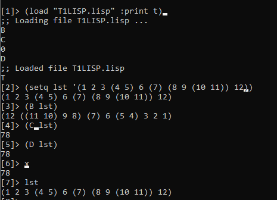

# Tarea 1

### 1. Escribir una función en LISP que invierta una lista a profundidad sin usar mapcar.
Regresa la lista inversa, método no destructivo
```
(defun B (lst)
	(cond 
		((atom lst) lst)
		(t (append (B (cdr lst)) (list (B (car lst)))))
		
	)
)
```


### 2. Escribir una función en LISP que sume una lista a profundidad usando mapcar.
Usamos variable auxiliar `x` y va sumando ahi. Regresa la suma de los elementos de la lista. 
Método no destructivo. No maneja listas que 
tengan elementos que no sean números.

`(setq x 0)`

```
(defun D(lst)
	(cond 
		((listp lst) (mapcar #'D lst) x) 
		(t (incf x lst))
	)
)
```
Para ejecutar, llenar lista en D:
`(setq x 0)(D '( ))`

#### Nota: No corre si la lista tiene valores no numéricos.

### 3. Escribir una función en LISP que sume una lista a profundidad sin usar mapcar.
Usa la misma estructura que la 1. Suma a profundidad sin usar mapcar, no usa variables 
auxiliares de ambiente. 
```
(defun C(lst)
	(cond 
		((null lst) 0)
		((atom lst) lst)
		(t (+ (C (cdr lst)) (C (car lst))))
	)
)
```
#### Nota: No corre si la lista tiene valores no numéricos
### Guia ejecución:
1. Abrir una terminal en el directorio del archivo.
2. Levantar CLISP usando el comando `clisp`.
2. Ejecutar: `(load "T1LISP.lisp" :print t)`.
3. Crear lista: `(setq lst '(1 2 3 (4 5 (6 7) 8) 9 (((10)))))`.
4. Correr funciones:
`(B lst)`, 
`(C lst)` y 
`(setq x 0)(D lst)`.
### Ejemplo ejecución:


